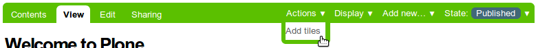
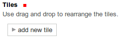
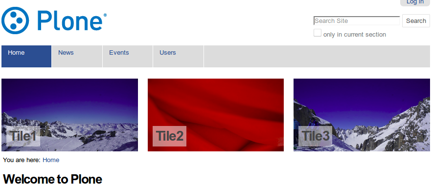

TX Tiles
============
This product allows you to add tiles to any page on a plone (version 4.3) site.

See also configuration and layout README

How to use
----------
On a page, click actions -> Add tiles.

This opens a setting page for your tiles. Tiles can be added by clicking ``add new tile``.

Access the slider configuration through the ``Tiles`` tab.

The slides are rendered by viewlets (at portaltop, belowcontenttitle or belowcontent).
	   

TODO
----
As of now only english and german translation is available.

Installation
------------
* add tx.tiles to your eggs sections
* re-run buildout
* install the product in the Control Panel

Uninstall
---------
* Uninstall like normal

Credits and Contributions
-------------------------
* tx.tiles is based on collective.easyslider. Thanks for the ideas!
* University of Freiburg (Technische Fakultät) for sponsoring the package
    
